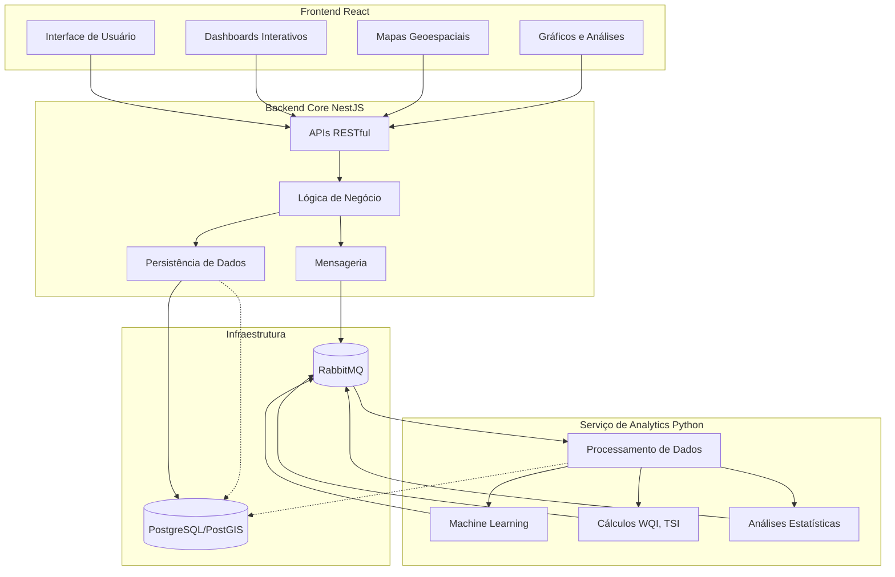

# HydroVision

<p align="center">
  
</p>

<p align="center">
  <strong>Análise Avançada da Qualidade da Água para Gestão Sustentável de Recursos Hídricos</strong>
</p>

<p align="center">
  <a href="#visão-geral">Visão Geral</a> •
  <a href="#objetivos">Objetivos</a> •
  <a href="#arquitetura">Arquitetura</a> •
  <a href="#tecnologias">Tecnologias</a> •
  <a href="#metodologia">Metodologia</a> •
  <a href="#estrutura-do-projeto">Estrutura do Projeto</a> •
  <a href="#como-contribuir">Como Contribuir</a> •
  <a href="#licença">Licença</a>
</p>

---

## Visão Geral

O **HydroVision** é um sistema integrado de monitoramento e análise da qualidade da água, focado inicialmente no reservatório do Passaúna, um importante manancial de abastecimento da região metropolitana de Curitiba que atende mais de 500.000 habitantes. O projeto surgiu da necessidade de unir engenharia de recursos hídricos e saneamento ambiental com tecnologias modernas de programação para oferecer uma plataforma robusta de avaliação da sustentabilidade de sistemas de abastecimento de água.

Em um contexto de crescentes desafios hídricos, incluindo mudanças climáticas, expansão urbana e aumento da demanda por água potável, ferramentas avançadas de análise se tornam fundamentais para a gestão sustentável dos recursos hídricos. O HydroVision responde a essa necessidade através da combinação de indicadores hidroambientais, sistemas de informação geográfica (GIS) e modelos preditivos baseados em aprendizado de máquina.

> **Status do Projeto:** Em desenvolvimento ativo

## Objetivos

### Objetivo Geral

Avaliar a sustentabilidade do sistema de abastecimento de água do reservatório do Passaúna, utilizando indicadores hidroambientais (WQI), tecnologias GIS e modelos de previsão, com base em dados históricos disponibilizados por órgãos públicos e empresas de saneamento ambiental.

### Objetivos Específicos

1. **Análise de Indicadores Hidroambientais**
   - Processar e analisar séries históricas de dados de qualidade da água (pH, OD, DBO, nitratos, fosfatos, etc.)
   - Calcular o Water Quality Index (WQI) e Trophic State Index (TSI) conforme metodologias estabelecidas
   - Identificar tendências temporais e padrões nos indicadores de qualidade

2. **Modelagem Preditiva**
   - Desenvolver modelos de aprendizado de máquina para prever a qualidade da água
   - Implementar análises de cenários e simulações de impacto
   - Estabelecer sistemas de alerta precoce para deterioração da qualidade da água

3. **Visualização Geoespacial**
   - Integrar dados de qualidade da água com sistemas de informação geográfica
   - Possibilitar análises espaciais dos parâmetros hidroambientais
   - Criar interfaces intuitivas para visualização e interpretação dos dados

4. **Suporte à Tomada de Decisão**
   - Fornecer dashboards interativos para gestores de recursos hídricos
   - Gerar relatórios e análises de conformidade com padrões regulatórios
   - Oferecer recomendações baseadas em dados para a gestão sustentável do reservatório

## Arquitetura

O HydroVision utiliza uma arquitetura moderna baseada em microsserviços, composta por três componentes principais que se comunicam entre si:



### 1. Backend Core (NestJS)

O núcleo do sistema é desenvolvido em NestJS, responsável por:
- Gerenciar a persistência de dados no PostgreSQL/PostGIS
- Implementar a lógica de negócio principal
- Fornecer APIs RESTful para o frontend
- Coordenar a comunicação entre todos os componentes via mensageria (RabbitMQ)

### 2. Serviço de Analytics (Python)

Um serviço especializado em Python utilizando FastAPI para:
- Executar cálculos complexos (WQI, TSI, etc.)
- Implementar e executar modelos de machine learning
- Processar análises estatísticas e de tendências
- Executar operações intensivas de processamento de dados

### 3. Frontend (React)

Interface de usuário moderna e responsiva para:
- Visualizar dashboards interativos
- Exibir mapas geoespaciais com dados de qualidade
- Apresentar gráficos e análises temporais
- Oferecer ferramentas de consulta e filtragem de dados

### Integração e Comunicação

Os componentes se comunicam através de:
- **Message Queue (RabbitMQ)**: Para processamento assíncrono e tarefas complexas
- **APIs REST**: Para operações sincronas e consultas em tempo real
- **Banco de Dados Compartilhado**: PostgreSQL com extensão PostGIS para dados geoespaciais

## Tecnologias

O HydroVision utiliza um conjunto moderno de tecnologias para cada componente do sistema:

### Backend

- **NestJS**: Framework Node.js para construção de APIs escaláveis e bem estruturadas
- **TypeScript**: Linguagem fortemente tipada para desenvolvimento seguro e manutenível
- **Prisma**: ORM para interação com o banco de dados
- **RabbitMQ**: Sistema de mensageria para comunicação assíncrona entre serviços
- **Jest**: Framework de testes para garantir qualidade do código

### Serviço de Analytics

- **Python**: Linguagem ideal para processamento de dados científicos
- **FastAPI**: Framework moderno para APIs com alto desempenho
- **Poetry**: Gerenciamento de dependências e ambientes virtuais
- **Pandas/NumPy**: Manipulação e análise de dados
- **Scikit-learn**: Implementação de modelos de machine learning
- **SQLAlchemy**: ORM para interação com o banco de dados
- **GeoAlchemy2**: Extensão para lidar com dados geoespaciais

### Frontend

- **React**: Biblioteca JavaScript para construção de interfaces de usuário
- **TypeScript**: Tipagem estática para desenvolvimento front-end robusto
- **Mapbox/Leaflet**: Bibliotecas para visualização de mapas interativos
- **D3.js/Recharts**: Bibliotecas para visualização de dados e gráficos avançados
- **Material-UI/Tailwind CSS**: Frameworks de design para interfaces modernas

### Infraestrutura

- **Docker/Docker Compose**: Containerização para desenvolvimento e produção
- **PostgreSQL**: Banco de dados relacional de alta performance
- **PostGIS**: Extensão espacial para PostgreSQL
- **GitHub Actions**: CI/CD para automação de testes e deploy

## Metodologia

O desenvolvimento do HydroVision segue uma abordagem multidisciplinar, combinando métodos científicos da engenharia civil/ambiental com práticas modernas de desenvolvimento de software:

### Engenharia Civil/Ambiental

- **Análise de Séries Temporais**: Identificação de tendências e padrões nos dados de qualidade da água
- **Indicadores de Qualidade**: Implementação do Water Quality Index (WQI) e Trophic State Index (TSI)
- **Modelagem Hidroambiental**: Simulações e predições baseadas em parâmetros físico-químicos
- **Avaliação de Conformidade**: Verificação de conformidade com padrões legais (CONAMA 357)

### Ciência de Dados

- **Pré-processamento de Dados**: Limpeza, normalização e transformação de dados brutos
- **Análise Exploratória**: Identificação de correlações e padrões nos dados
- **Modelagem Preditiva**: Implementação de algoritmos de regressão, séries temporais e aprendizado profundo
- **Validação Cruzada**: Avaliação rigorosa da precisão e generalização dos modelos

### Desenvolvimento de Software

- **Desenvolvimento Ágil**: Sprints curtas com entregas incrementais
- **Domain-Driven Design (DDD)**: Modelagem orientada ao domínio do problema
- **Arquitetura Hexagonal**: Separação clara entre lógica de negócio e infraestrutura
- **Testes Automatizados**: Garantia de qualidade através de testes unitários, integração e e2e
- **CI/CD**: Integração e entrega contínuas para rápido feedback e iteração

## Estrutura do Projeto

O projeto está organizado em três repositórios principais, representando cada componente da arquitetura:

```
hydrovision/
├── backend_hydrovision_nestjs/     # Serviço backend principal
│   ├── src/
│   │   ├── domain/                 # Modelos e regras de domínio
│   │   ├── application/            # Casos de uso e serviços
│   │   ├── infrastructure/         # Implementações técnicas e adaptadores
│   │   └── presentation/           # Controllers e DTOs
│   └── ...
│
├── python_analytics_service/       # Serviço de análise de dados e ML
│   ├── hydrovision_analytics/
│   │   ├── api/                    # Endpoints FastAPI
│   │   ├── core/                   # Lógica de negócio e calculadoras
│   │   ├── db/                     # Modelos e sessões SQLAlchemy
│   │   ├── messaging/              # Consumidores e produtores RabbitMQ
│   │   └── utils/                  # Utilitários diversos
│   └── ...
│
└── frontend_hydrovision_react/     # Interface de usuário
    ├── src/
    │   ├── components/             # Componentes React reutilizáveis
    │   ├── pages/                  # Páginas da aplicação
    │   ├── services/               # Serviços de comunicação com APIs
    │   ├── hooks/                  # Hooks personalizados
    │   └── utils/                  # Utilitários diversos
    └── ...
```

## Dados e Indicadores

O sistema trabalha com diversos indicadores e parâmetros de qualidade da água:

### Parâmetros Físico-Químicos e Biológicos

- pH
- Oxigênio Dissolvido (OD)
- Demanda Bioquímica de Oxigênio (DBO)
- Nitrogênio Total (NT)
- Fósforo Total (PT)
- Temperatura
- Turbidez
- Sólidos Totais
- Coliformes Termotolerantes

### Índices de Qualidade

- **Water Quality Index (WQI)**: Índice agregado que representa a qualidade geral da água
- **Trophic State Index (TSI)**: Indica o estado trófico do corpo d'água, relacionado à eutrofização
- **Shannon-Weaver Index (H')**: Medida de biodiversidade dos macroinvertebrados

## Cronograma do Projeto

O desenvolvimento do HydroVision segue as seguintes fases:

1. **Fase 1: Planejamento e Design (Em andamento)**
   - Definição da arquitetura
   - Modelagem de dados
   - Especificação de requisitos

2. **Fase 2: Desenvolvimento do MVP (Próxima)**
   - Implementação do backend NestJS
   - Desenvolvimento do serviço Python básico
   - Frontend com visualizações essenciais

3. **Fase 3: Expansão de Funcionalidades (Planejada)**
   - Modelos preditivos avançados
   - Integração GIS completa
   - Dashboards interativos

4. **Fase 4: Validação e Teste (Planejada)**
   - Validação científica dos modelos
   - Testes de usabilidade
   - Avaliação de desempenho

5. **Fase 5: Implantação e Documentação (Planejada)**
   - Publicação dos resultados
   - Documentação completa
   - Lançamento da versão estável

## Base Científica

O HydroVision se baseia em pesquisas científicas sólidas no campo da qualidade da água e gestão de recursos hídricos. Estudos prévios sobre o reservatório do Passaúna, como o artigo "Index-based and compliance assessment of water quality for a Brazilian subtropical reservoir" (Rauen et al., 2018), fornecem dados históricos valiosos e metodologias de análise que são incorporadas ao sistema.

A plataforma integra conhecimentos de diversas áreas:
- Engenharia Ambiental e de Recursos Hídricos
- Ciência de Dados e Aprendizado de Máquina
- Sistemas de Informação Geográfica
- Engenharia de Software

## Potenciais Impactos

O HydroVision tem o potencial de gerar impactos significativos:

- **Científicos**: Integração inovadora de tecnologias computacionais e ciências ambientais
- **Ambientais**: Monitoramento eficaz e prevenção de degradação da qualidade da água
- **Sociais**: Contribuição para a segurança hídrica de populações urbanas
- **Econômicos**: Otimização da gestão de recursos hídricos e redução de custos de tratamento

## Desenvolvimento

O HydroVision é um projeto pessoal desenvolvido por Rudhy Maycon Pereira da Costa com o intuito de corroborar com uma futura aplicação para o program de mestrado em Engenharia de Recursos Hídricos e Ambiental

---

<p align="center">
  Desenvolvido por Rudhy Maycon Pereira da Costa
</p>
